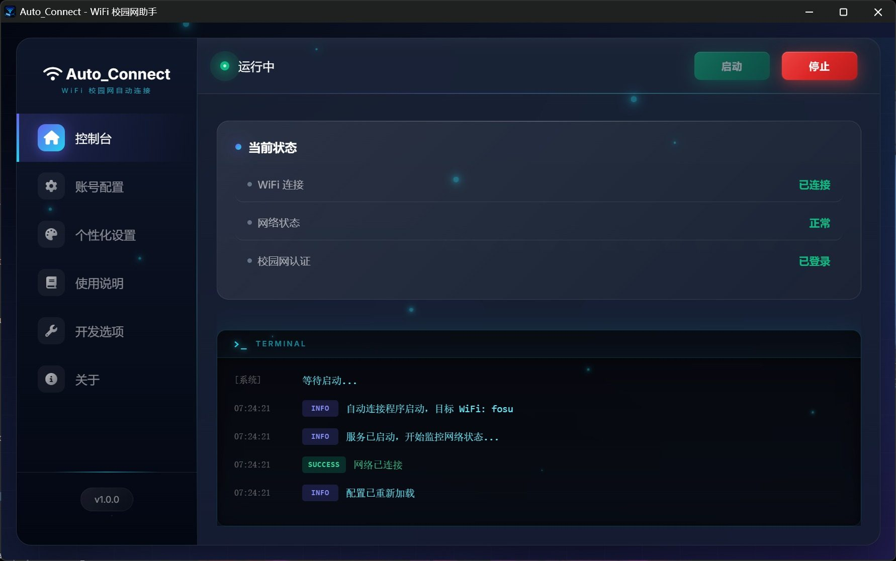

# 🎓 Auto Connect

 <div align="center">

 
 
 
 
 
 
 

 **校园网自动连接工具 - 解决校园网频繁掉线和重复登录问题**

 [English](#english) | [中文](#中文)

 </div>

 ---
 ## 🎨 界面预览

| 主界面 |
|---------|
|  |

---

## ✨ 核心特性

### 🔌 智能连接
- **WiFi 自动连接** - 自动连接到指定校园WiFi热点
- **校园网自动认证** - 支持锐捷(Ruijie) ePortal 系统校园网认证方式
- **智能重连机制** - 网络断开后自动检测并重新连接

### 🎨 现代化界面
- **内置浏览器界面** - 采用便携版 Chromium 提供流畅图形界面（可选）
- **系统托盘运行** - 最小化到系统托盘，后台稳定运行
- **双模式运行** - 支持内置浏览器或系统默认浏览器

### 🔧 专业功能
- **日志记录** - 完整的运行日志记录功能
- **配置持久化** - 自动保存用户配置和偏好
- **异常处理** - 完善的错误提示和恢复机制

### 🚀 技术特色
- **单文件打包** - 支持打包为独立的exe可执行文件
- **Eel框架** - Python与Web技术的完美结合
- **RSA加密** - 支持安全的登录认证（需要Node.js）

---

## 🚀 快速开始

### 系统要求

- **操作系统**：Windows 11
- **Python版本**：3.8+
- **Node.js**：用于RSA加密认证
- **内存**：至少512MB可用内存

### 安装运行

#### 方法一：直接下载exe（推荐）
1. 前往 Releases 页面下载最新版本
2. 双击运行即可使用

#### 方法二：源码运行
```bash
# 克隆仓库
git clone https://github.com/your-repo/Auto_Connect.git
cd Auto_Connect

# 安装依赖
pip install -r requirements.txt

# 运行程序
python auto_connect.py
```

### 依赖说明
```txt
eel>=0.14.0          # Python Web GUI 框架
pystray>=0.19.0     # 系统托盘支持
pillow>=9.0.0       # 图片处理
pyinstaller>=5.0    # 程序打包
```

---

## 📖 使用指南

### 第一步：首次配置
1. 运行程序后自动打开配置界面
2. 输入校园网 WiFi 名称（SSID）
3. 输入校园网账号和密码
4. 点击保存配置

### 第二步：启动服务
1. 点击"启动服务"按钮
2. 程序会自动连接校园网WiFi
3. 自动完成校园网认证登录

### 第三步：后台运行
1. 程序会自动最小化到系统托盘
2. 持续监控网络状态
3. 断线自动重连，无需人工干预

---

## 📁 项目结构

```
Auto_Connect/
├── auto_connect.py          # 主程序入口
├── core/                    # 核心模块
│   ├── campus_login.py      # 校园网登录
│   ├── config.py            # 配置管理
│   └── wifi_manager.py      # WiFi 连接管理
├── browser/                 # 浏览器模块
│   └── custom_chrome.py     # 内置 Chrome 启动器
├── chromium/                # 便携版 Chromium（可选）
├── gui/                     # 前端资源
├── post/                    # 登录认证脚本
├── scripts/                 # 脚本目录
├── history/                 # 历史自动连接脚本
├── requirements.txt         # Python 依赖
└── Auto_Connect.spec        # PyInstaller 配置文件
```

---

## 🔧 Chromium 安装（可选）

本项目的 `chromium` 目录默认已被 `.gitignore` 忽略，如需使用内置浏览器界面，请手动下载并放置：

### 必需文件

下载 Chromium 便携版（版本：**125.0.6422.113**），将以下文件放入 `chromium/` 目录：

```
chromium/
├── chrome.exe              # 主程序
├── 125.0.6422.113
└── Dictionaries
```

### 下载地址

- [Chromium Browser Downloads](https://github.com/Hibbiki/chromium-win64/releases/download/v125.0.6422.113-r1287751/chrome.nosync.7z)
- 或自行搜索 `Chromium 125.0.6422.113 portable`

### 注意事项

- 若未放置 Chromium，程序启动时会自动使用系统默认浏览器
- 终端会显示提示信息引导下载安装
- 使用内置 Chromium 可获得更好的界面体验

---

## ⚙️ 配置说明

首次运行后，会在用户目录下生成配置文件 `auto_connect_config.json`，主要配置项包括：

| 配置项 | 说明 |
|--------|------|
| wifi_ssid | 目标校园WiFi名称 |
| wifi_password | WiFi密码 |
| login_url | 校园网登录URL |
| login_username | 登录账号 |
| login_password | 登录密码 |
| check_interval | 网络检查间隔（秒） |
| retry_count | 最大重试次数 |

---

## 🛠️ 打包发布

```bash
pyinstaller --onedir --contents-directory . --name Auto_Connect --add-data "gui;gui"  --add-data "chromium;chromium" --add-data "post;post" --add-data "LICENSE;." --noconsole --version-file file_version_info.txt -i favicon.ico auto_connect.py
```

---

## ⚠️ 注意事项

- 确保已安装 Node.js（用于生成RSA加密的登录数据）
- 内置 Chromium 会占用约350MB磁盘空间
- 配置文件和日志文件存储在用户目录下
- 部分校园网可能需要额外的认证参数配置

---

## 📄 许可证

本项目采用 MIT 许可证 - 点击 [LICENSE](LICENSE) 文件查看详情。

---

## 🙏 致谢

感谢以下开源项目的支持：

- [Eel](https://github.com/python-eel/Eel) - Python Web GUI 框架
- [PyInstaller](https://github.com/pyinstaller/pyinstaller) - 程序打包
- [pystray](https://github.com/moses-palmer/pystray) - 系统托盘支持
- [Chromium](https://www.chromium.org/) - 内置浏览器

---

 <div align="center">

 **如果这个项目对您有帮助，请给个⭐️支持一下！**

 </div>

 ---

## English

# 🎓 Auto Connect

A modern campus network auto-connect tool designed to solve frequent disconnections and repeated login issues on school networks.

### Key Features
- Smart WiFi auto-connection to campus networks
- Automatic campus network authentication (DRCOM, JLGC, etc.)
- Intelligent reconnection mechanism
- Built-in browser interface with optional Chromium
- System tray operation for stable background running
- Complete logging functionality

### Quick Start
```bash
# Clone the repository
git clone https://github.com/your-repo/Auto_Connect.git
cd Auto_Connect

# Install dependencies
pip install -r requirements.txt

# Run the program
python auto_connect.py
```

### For detailed documentation, please refer to the Chinese section above.